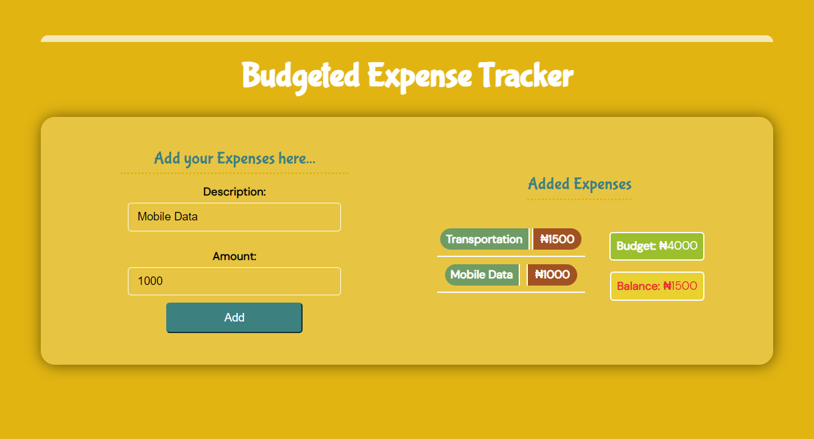
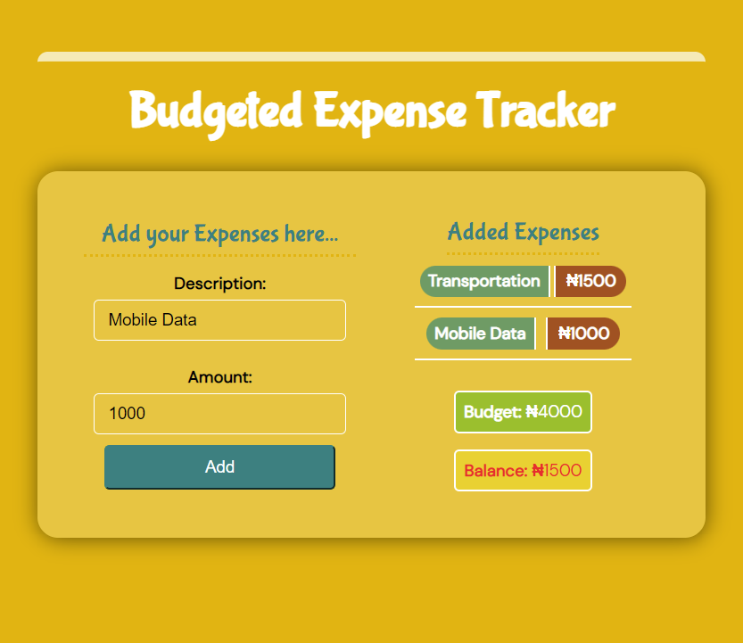
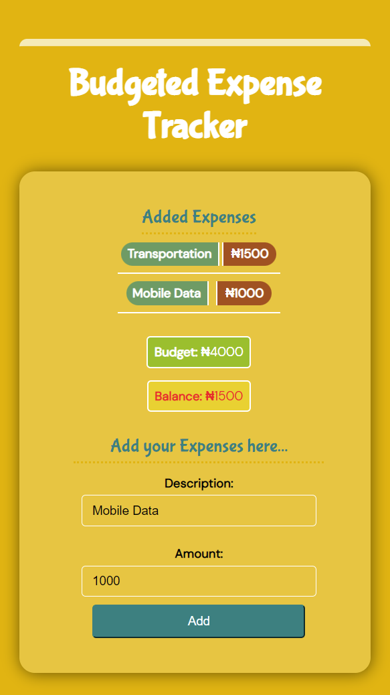
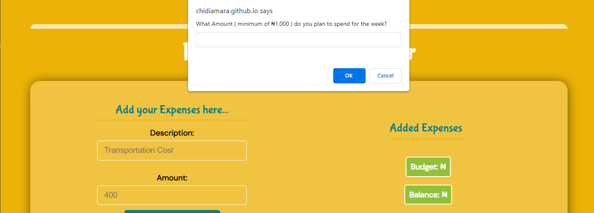

# Budgeted Expense Tracker

This is a responsive weekly expense tracker built with HTML, CSS and JavaScript. It is mainly used to showcase my front-end skills in the use of HTML, CSS and JavaScript. No framework was used in building this expense tracker.

Thus far, it has helped me improve in object-oriented programming as well as DOM manipulation in JavaScript.

<!--  {width="70%" style="display: inline-block; margin: 0 auto 0 15%" } -->

   > **When the input field pops up, type amount minimum of 1000 and click ok or enter key**

[CLICK HERE TO VIEW](https://chidiamara.github.io/expense-tracker/with-vanilla-js/index.html
"Expense Tracker")

   > If you love the interface, give it a star.

## Limitations of This Project

 1. When an expense is added, it can't be deleted.
 1. It has an input pop-up onload for amount instead on an embedded input in html.
 1. It does not save expenses for later view after quit.

  > It mainly showcases my ability to build a responsive mobile friendly view with no framework.
  >
  >I am Working on a better expense tracker with options like, salary, investment and expenses (add and delete inclusive). I may use JavaScript Framework in the new Expense Tracker.

## Open For Fork and Contributions

To make contributions to this current work, fork the repository and make your contributions. If contribution is nice, i will update and reference you.
